### Содержание
1. [Инструкция по запуску](#инструкция-по-запуску)
2. [Демонстрация работы (сценарии использования)](#демонстрация-работы-сценарии-использования)
   - [Быстрый тестовый сценарий](#быстрый-тестовый-сценарий)
   - [Примеры API-запросов (curl)](#примеры-api-запросов-curl)
   - [Swagger / ReDoc](#swagger--redoc)
   - [Telegram-бот](#telegram-бот)
3. [Схема данных в СУБД](#схема-данных-в-субд)
4. [Описание основных REST-эндпоинтов](#описание-основных-rest-эндпоинтов)
   - [Клиенты (Clients)](#клиенты-clients)
   - [Рекламодатели (Advertisers)](#рекламодатели-advertisers)
   - [ML-скоры (ML Scores)](#ml-скоры-ml-scores)
   - [Рекламные кампании (Campaigns)](#рекламные-кампании-campaigns)
   - [Показ рекламы и клики (Ads)](#показ-рекламы-и-клики-ads)
   - [Статистика (Stats)](#статистика-stats)
   - [Управление временем (Time)](#управление-временем-time)
   - [Загрузка изображений (Upload)](#загрузка-изображений-upload)
5. [Архитектура и логика работы](#архитектура-и-логика-работы)
   - [Выбор объявления (основной алгоритм)](#выбор-объявления-основной-алгоритм)
   - [Лимиты показов и кликов](#лимиты-показов-и-кликов)
   - [Таргетинг](#таргетинг)
   - [Модерация объявлений](#модерация-объявлений)
6. [Интеграция с дополнительными сервисами](#интеграция-с-дополнительными-сервисами)
   - [Telegram-бот](#telegram-бот-1)
   - [Grafana](#grafana)
7. [Обоснованность выбора технологий](#обоснованность-выбора-технологий)
8. [Тестирование](#тестирование)
9. [FAQ / Важные детали](#faq--важные-детали)

---

## Инструкция по запуску

1. **Установите** Docker и Docker Compose (совместимые версии).
2. **Перейдите** в папку `solution` (где расположен `docker-compose.yml`).
3. Запустите:
   ```bash
   docker-compose up -d
   ```
4. Дождитесь и убедитесь, что контейнеры запущены:
   - `db` (Postgres 15)
   - `backend` (Uvicorn + FastAPI)
   - `grafana` (опционально для дашбордов)
5. Откройте в браузере:
   - Приложение (API): `http://localhost:8080`
   - Grafana (при необходимости): `http://localhost:3000` (логин/пароль: `admin/admin`)

> **По умолчанию** приложение запускается на порту `8080`.
> При первом старте автоматически создаются таблицы в БД.

---

## Демонстрация работы (сценарии использования)

### Быстрый тестовый сценарий
1. **Установить текущий день** (чтобы проверить валидацию дат в кампаниях):
   ```bash
   curl -X POST "http://localhost:8080/time/advance" \
        -H "Content-Type: application/json" \
        -d '{"current_date":1}'
   ```
2. **Добавить пользователей**:
   ```bash
   curl -X POST "http://localhost:8080/clients/bulk" \
        -H "Content-Type: application/json" \
        -d '[
          {
            "client_id": "00000000-0000-0000-0000-000000000001",
            "login": "client1",
            "age": 25,
            "location": "Moscow",
            "gender": "MALE"
          }
        ]'
   ```
3. **Добавить рекламодателя**:
   ```bash
   curl -X POST "http://localhost:8080/advertisers/bulk" \
        -H "Content-Type: application/json" \
        -d '[
          {
            "advertiser_id": "10000000-0000-0000-0000-000000000000",
            "name": "MegaAdvertiser"
          }
        ]'
   ```
4. **Добавить ML-скор**:
   ```bash
   curl -X POST "http://localhost:8080/ml-scores" \
        -H "Content-Type: application/json" \
        -d '{
          "client_id": "00000000-0000-0000-0000-000000000001",
          "advertiser_id": "10000000-0000-0000-0000-000000000000",
          "score": 50
        }'
   ```
5. **Создать рекламную кампанию**:
   ```bash
   curl -X POST "http://localhost:8080/advertisers/10000000-0000-0000-0000-000000000000/campaigns" \
        -H "Content-Type: application/json" \
        -d '{
          "impressions_limit": 10,
          "clicks_limit": 5,
          "cost_per_impression": 1.0,
          "cost_per_click": 5.0,
          "ad_title": "Super Sale",
          "ad_text": "Up to 50% discount!",
          "start_date": 1,
          "end_date": 3,
          "targeting": {
            "gender": "ALL",
            "age_from": 18,
            "age_to": 65,
            "location": "Moscow"
          }
        }'
   ```
6. **Получить объявление для клиента**:
   ```bash
   curl "http://localhost:8080/ads?client_id=00000000-0000-0000-0000-000000000001"
   ```
   Если всё в порядке, вернёт JSON с данными об объявлении.
   Если нет доступных кампаний, вернёт `404`.
7. **Зарегистрировать клик**:
   ```bash
   curl -X POST "http://localhost:8080/ads/123e4567-e89b-12d3-a456-426614174000/click" \
     -H "Content-Type: application/json" \
     -d '{"client_id":"00000000-0000-0000-0000-000000000001"}'
   ```
8. **Посмотреть статистику**:
   ```bash
   curl "http://localhost:8080/stats/campaigns/123e4567-e89b-12d3-a456-426614174000"
   ```

### Примеры API-запросов (curl)
Все основные примеры см. выше.
Полный список доступен в Swagger.

### Swagger / ReDoc
- **Swagger UI**: <http://localhost:8080/docs>
- **ReDoc**: <http://localhost:8080/redoc>

Позволяет визуально тестировать и изучать схемы эндпоинтов.

### Telegram-бот
В проекте есть интеграция с Telegram-ботом (папка `bot/`).
Если вы укажете токен в переменной среды `BOT_TOKEN` и запустите `bot_cli.py`, вы сможете:
- Авторизоваться как рекламодатель (указать `advertiser_id`)
- Создавать / редактировать / просматривать свои кампании
- Смотреть статистику по кампаниям и т.д.

---

## Схема данных в СУБД


Основные таблицы и их поля:

1. **clients** (`Client`):
   - `id` (UUID, PK)
   - `login` (String)
   - `age` (Integer)
   - `location` (String)
   - `gender` (Enum: MALE/FEMALE)

2. **advertisers** (`Advertiser`):
   - `advertiser_id` (UUID, PK)
   - `name` (String)

3. **ml_scores** (`MLScore`):
   - `client_id` (UUID, PK, FK->clients.id)
   - `advertiser_id` (UUID, PK, FK->advertisers.advertiser_id)
   - `score` (Integer)

4. **campaigns** (`Campaign`):
   - `campaign_id` (UUID, PK)
   - `advertiser_id` (UUID, FK->advertisers.advertiser_id)
   - `impressions_limit` (Integer)
   - `clicks_limit` (Integer)
   - `cost_per_impression` (Float)
   - `cost_per_click` (Float)
   - `ad_title` (String)
   - `ad_photo_url` (String, nullable)
   - `ad_text` (Text)
   - `start_date` (Integer)
   - `end_date` (Integer)
   - `target_gender` (Enum: MALE/FEMALE/ALL)
   - `target_age_from` (Integer)
   - `target_age_to` (Integer)
   - `target_location` (String)
   - `is_deleted` (Boolean)
   - `create_date` (DateTime)

5. **ad_events** (`AdEvent`):
   - `id` (UUID, PK)
   - `campaign_id` (UUID, FK->campaigns.campaign_id)
   - `client_id` (UUID, FK->clients.id)
   - `event_type` (Enum: IMPRESSION/CLICK)
   - `event_timestamp` (DateTime)
   - `event_day` (Integer)

6. **system_time** (`SystemTime`):
   - `id` (Integer, PK)
   - `current_date` (Integer)

---

## Описание основных REST-эндпоинтов

### Клиенты (Clients)

- `POST /clients/bulk`
  Создание/обновление списка клиентов (массив JSON).
  ```json
  [
    {
      "client_id": "00000000-0000-0000-0000-000000000001",
      "login": "client1",
      "age": 25,
      "location": "Moscow",
      "gender": "MALE"
    }
  ]
  ```
- `GET /clients/{clientId}`
  Получить информацию о клиенте по UUID.

### Рекламодатели (Advertisers)

- `POST /advertisers/bulk`
  Аналогично, создание/обновление пачкой.
- `GET /advertisers/{advertiserId}`
  Получить инфо о рекламодателе.

### ML-скоры (ML Scores)

- `POST /ml-scores`
  Добавить (или обновить) ML-score для пары (client_id + advertiser_id):
  ```json
  {
    "client_id": "...",
    "advertiser_id": "...",
    "score": 50
  }
  ```

### Рекламные кампании (Campaigns)

> Пример URL: `/advertisers/{advertiserId}/campaigns`

- `POST /advertisers/{advertiserId}/campaigns`
  Создать новую кампанию. Поддерживает параметр `generate_text=true` для генерации текста через LLM.
- `GET /advertisers/{advertiserId}/campaigns`
  Получить список кампаний (с пагинацией: `page`, `size`).
- `GET /advertisers/{advertiserId}/campaigns/{campaignId}`
  Получить кампанию по ID.
- `PUT /advertisers/{advertiserId}/campaigns/{campaignId}`
  Обновить поля кампании (часть или все).
- `DELETE /advertisers/{advertiserId}/campaigns/{campaignId}`
  Удалить кампанию.

### Показ рекламы и клики (Ads)

- `GET /ads?client_id=UUID`
  Вернёт **одно** подходящее объявление (или 404), учитывая:
  - Текущий день (должен попадать в [start_date, end_date])
  - Таргетинг (пол, возраст, локация)
  - Не превышены лимиты (уникальные показы/клики)
  - ML Score влияет на выбор и порядок.
  При первом показе фиксируется событие `IMPRESSION`.
- `POST /ads/{adId}/click`
  Фиксирует клик (если у клиента уже был показ и лимит кликов не превышен).

### Статистика (Stats)

- `GET /stats/campaigns/{campaignId}`
  Общая статистика по кампании:
  ```json
  {
    "impressions_count": 10,
    "clicks_count": 2,
    "conversion": 20.0,
    "spent_impressions": 10.0,
    "spent_clicks": 10.0,
    "spent_total": 20.0
  }
  ```
- `GET /stats/advertisers/{advertiserId}/campaigns`
  Суммарная статистика по всем кампаниям данного рекламодателя.
- `GET /stats/campaigns/{campaignId}/daily`
  Подневная статистика (массив).
- `GET /stats/advertisers/{advertiserId}/campaigns/daily`
  Подневная статистика суммарно по всем кампаниям рекламодателя.

### Управление временем (Time)

- `POST /time/advance`
  Установить логический `current_date` (день). Например:
  ```json
  {
    "current_date": 2
  }
  ```

### Загрузка изображений (Upload)

- `POST /upload/photo`
  Принимает form-data (ключ "file"), сохраняет изображение в CDN/S3, возвращает URL:
  ```json
  {
    "file_url": "https://..."
  }
  ```

---

## Архитектура и логика работы

### Выбор объявления (основной алгоритм)
1. Запрос `GET /ads?client_id=...`.
2. Сначала фильтр по активным кампаниям (дата, лимиты, таргетинг).
3. Для каждой кампании рассчитывается условный показатель выгоды (учитывая ML Score).
4. Кампания с максимальным показателем возвращается клиенту.
5. Если такого объявления нет (список пуст), возвращается 404.
6. Если клиент видит кампанию впервые, записывается событие `IMPRESSION`.

Подробнее в схеме:


### Лимиты показов и кликов
- **Уникальные** показы и клики (только первый раз) влияют на `impressions_limit` и `clicks_limit`.
- Если лимит превышен — кампания не показывается дальше.

### Таргетинг
- `target_gender`: MALE / FEMALE / ALL
- `target_age_from`, `target_age_to`: диапазон возраста
- `target_location`: строка, точное совпадение

### Модерация объявлений
- При создании или обновлении кампании возможно использовать вызов GPT для семантической проверки.
- Если поле `MODERATE_ADS = true`, и фича включена, объявление может блокироваться при нежелательном содержимом.
- Для доступа к API ChatGPT из России был поднят мой личный reverse-proxy на зарубежном сервере - https://gpt.kekz.site.

---

## Интеграция с дополнительными сервисами

### Telegram-бот
- Код в папке `bot/`.
- При запуске с валидным `BOT_TOKEN` в переменной окружения запускает интерфейс бота:
  - Авторизация по `advertiser_id`
  - Список / создание / редактирование кампаний
  - Просмотр статистики

### Grafana
- По умолчанию запускается в Docker Compose. Доступ: <http://localhost:3000>.
- Дашборды в папке `grafana/dashboards`. Настроены примеры аналитики (суммарная статистика, распределение по полу, возрасту и т.д.).

---

## Обоснованность выбора технологий

- **Python + FastAPI**: удобный асинхронный веб-фреймворк с простым доступом к OpenAPI (Swagger).
- **SQLAlchemy (async)**: удобная ORM, гибкие запросы, подходит для PostgreSQL.
- **PostgreSQL**: мощная реляционная СУБД, поддерживает транзакции, что критически важно для соблюдения лимитов в этом проекте.
- **Docker + Docker Compose**: обеспечивает унифицированный запуск всего стека (БД, backend, Grafana).
- **Grafana**: быстрая визуализация аналитики.
- **Telegram-бот**: даёт MVP-интерфейс вместо долгого ожидания наших коллег фронтендеров :).

---

## Тестирование

1. **Unit-тесты**: для ORM и прикладной логики.
2. **E2E-тесты**: эмуляция создания кампаний, пользователей, ML-скоров, вызов показов/кликов, проверка статистики.
3. **Ручное**: через Swagger, curl, Telegram-бот, Grafana.

---

## FAQ / Важные детали

1. **Что, если нет объявления для показа?** Возвращается `404`.
2. **ML Score по умолчанию** – `0`, если не задан.
3. **По умолчанию `MODERATE_ADS` выключена** (false) в `docker-compose.yml`.
4. **Пароли, ключи** – для корректного прохождения тестов хранятся в переменных окружения внутри `docker-compose`.
5. **Лимиты** – только по уникальным пользователям (1 клиент = 1 показ).